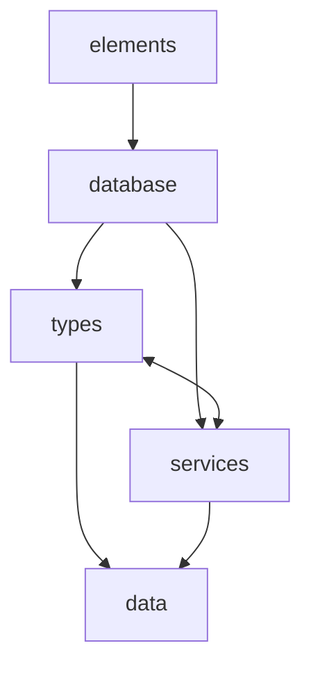

# Feature structure

Each feature folder contains layered subfolders. Higher layers may import from lower layers; never the reverse.

| Folder | Role |
|--------|------|
| `data/` | Archetypes, components, resources — ECS shape definitions |
| `types/` | Pure immutable data and synchronous helpers |
| `services/` | Async capability contracts and implementations |
| `database/` | ECS database wiring and persistence |
| `elements/` | UI |

`types/` and `services/` are peers at the same tier: both may import `data/`, and may import each other. `database/` may import either or both. `elements/` sits at the top and imports `database/`.

Reference implementations live in `./references/` — including `workspace-persistence-service` (load/save/persist) and `character-name-service` (fake async generation) under `services/`.
