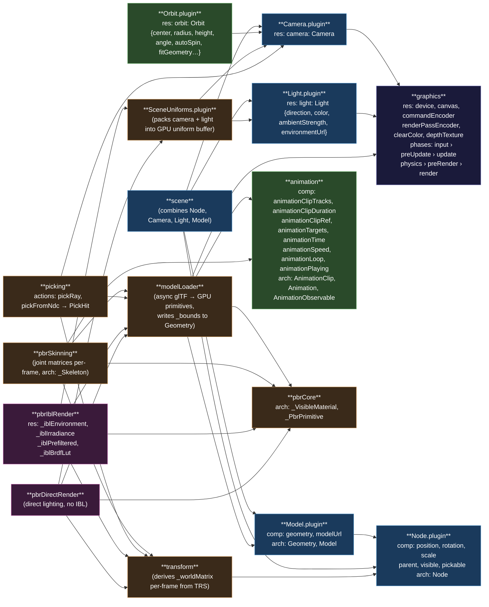

```mermaid
graph LR

%% ── Infrastructure ───────────────────────────────────────────────────────────
    graphics["**graphics**
    res: device, canvas, commandEncoder
    renderPassEncoder, clearColor, depthTexture
    phases: input › preUpdate › update
    physics › preRender › render"]

%% ── Core model plugins ───────────────────────────────────────────────────────
    Node["**Node.plugin**
    comp: position, rotation, scale
    parent, visible, pickable
    arch: Node"]

    Camera["**Camera.plugin**
    res: camera: Camera"]

    Light["**Light.plugin**
    res: light: Light
    {direction, color, ambientStrength, environmentUrl}"]

    Model["**Model.plugin**
    comp: geometry, modelUrl
    arch: Geometry, Model"]

    scene["**scene**
    (combines Node, Camera, Light, Model)"]

%% ── Authoring abstractions ───────────────────────────────────────────────────
    animation["**animation**
    comp: animationClipTracks, animationClipDuration
    animationClipRef, animationTargets, animationTime
    animationSpeed, animationLoop, animationPlaying
    arch: AnimationClip, Animation, AnimationObservable"]

    Orbit["**Orbit.plugin**
    res: orbit: Orbit
    {center, radius, height, angle, autoSpin, fitGeometry…}"]

%% ── System plugins ───────────────────────────────────────────────────────────
    sceneUniforms["**SceneUniforms.plugin**
    (packs camera + light into GPU uniform buffer)"]

    transform["**transform**
    (derives _worldMatrix per-frame from TRS)"]

    pbrCore["**pbrCore**
    arch: _VisibleMaterial, _PbrPrimitive"]

    modelLoader["**modelLoader**
    (async glTF → GPU primitives,
    writes _bounds to Geometry)"]

    pbrSkinning["**pbrSkinning**
    (joint matrices per-frame, arch: _Skeleton)"]

    picking["**picking**
    actions: pickRay, pickFromNdc → PickHit"]

%% ── Render aggregators ───────────────────────────────────────────────────────
    pbrIblRender["**pbrIblRender**
    res: _iblEnvironment, _iblIrradiance
    _iblPrefiltered, _iblBrdfLut"]

    pbrDirectRender["**pbrDirectRender**
    (direct lighting, no IBL)"]

%% ── Extends edges ────────────────────────────────────────────────────────────
    Camera          --> graphics
    Light           --> graphics
    modelLoader     --> graphics
    Model           --> Node
    scene           --> Node
    scene           --> Camera
    scene           --> Light
    scene           --> Model

    Orbit           --> Camera
    sceneUniforms   --> Camera
    sceneUniforms   --> Light

    transform       --> Node
    modelLoader     --> pbrCore
    modelLoader     --> Model
    modelLoader     --> animation

    pbrSkinning     --> modelLoader
    pbrSkinning     --> pbrCore
    pbrSkinning     --> transform
    pbrSkinning     --> animation

    picking         --> modelLoader
    picking         --> transform
    picking         --> Camera

    pbrIblRender    --> pbrCore
    pbrIblRender    --> modelLoader
    pbrIblRender    --> sceneUniforms
    pbrIblRender    --> transform

    pbrDirectRender --> pbrCore
    pbrDirectRender --> modelLoader
    pbrDirectRender --> sceneUniforms
    pbrDirectRender --> transform

%% ── Styling ──────────────────────────────────────────────────────────────────
    classDef core     fill:#1a3a5c,stroke:#4a8fc4,color:#fff
    classDef authoring fill:#2a4a2a,stroke:#6ab06a,color:#fff
    classDef system   fill:#3a2a1a,stroke:#c48a4a,color:#fff
    classDef renderer fill:#3a1a3a,stroke:#c46ab0,color:#fff
    classDef infra    fill:#1a1a3a,stroke:#6a6ab0,color:#fff

    class Node,Camera,Light,Model,scene core
    class animation,Orbit authoring
    class transform,pbrCore,modelLoader,pbrSkinning,sceneUniforms,picking system
    class pbrIblRender,pbrDirectRender renderer
    class graphics infra
```
