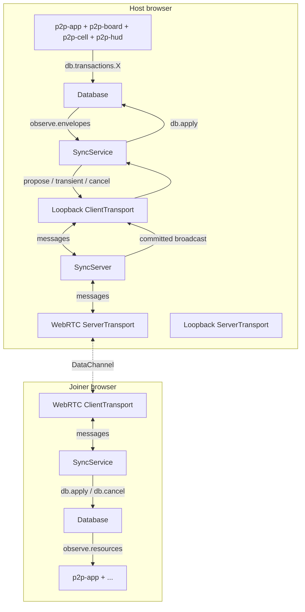
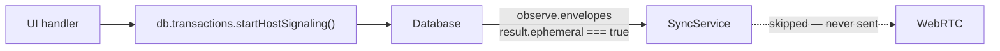
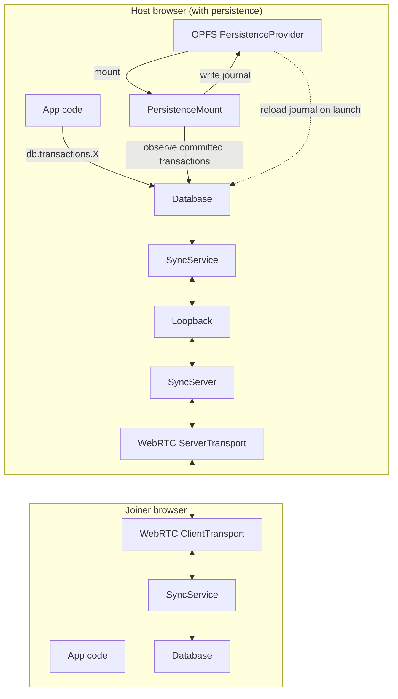

# P2P Tic-Tac-Toe — Architecture

A serverless two-player game that runs entirely in the browser.
No backend required: signaling is done by copy-pasting SDP blobs, and
real-time sync runs over a WebRTC DataChannel.

The application code never speaks to the sync layer directly. Every
mutation — whether a game move, a UI phase change, or a per-frame cursor
position — flows through `db.transactions.X(args)`. A `SyncService`
attached to the database transparently forwards outbound envelopes and
applies inbound envelopes from peers. UI-only state is marked
`ephemeral: true` on its resource schemas, and the sync service skips it.

---

## Current architecture — invisible sync via createSyncService

```mermaid
sequenceDiagram
    participant App as App code
    participant DB as Database (host)
    participant Sync as SyncService
    participant WR as WebRTC DataChannel
    participant Peer as Peer (joiner)

    Note over App,Peer: Connection setup (one-time)
    App->>App: RTCPeerConnection offer + gather ICE
    App-->>Peer: copy-paste SDP offer
    Peer-->>App: copy-paste SDP answer
    App->>App: createSyncService({ database, transport })
    Sync->>DB: setDeferredCommitMode(true)

    Note over App,Peer: Live game — committed moves
    App->>DB: db.transactions.playMove({ index })
    DB->>DB: apply locally as transient (time<0)
    DB->>Sync: observe.envelopes fires { intent:"commit" }
    Sync->>WR: send { kind:"propose", envelope }
    WR->>App: SyncServer assigns time, broadcasts committed
    App->>Sync: transport.onMessage { kind:"committed" }
    Sync->>DB: db.apply(committed) → rollback / rebase / replay
    Note over Peer: Peer receives same committed envelope
    Peer->>Peer: db.apply(committed)

    Note over App,Peer: Live game — presence (transient, never committed)
    App->>DB: db.transactions.movePresence(asyncGenerator)
    DB->>DB: apply each yield as transient (time<0)
    DB->>Sync: observe.envelopes fires { intent:"transient" }
    Sync->>WR: send { kind:"transient", envelope }
    WR->>Peer: SyncServer relays { kind:"committed", time<0 }
    Peer->>Peer: db.apply(transient) → cursorX/O resource updates

    Note over App,Peer: Local UI state (phase / banners / signaling codes)
    App->>DB: db.transactions.startHostSignaling()
    DB->>DB: applies; result.ephemeral = true
    DB->>Sync: observe.envelopes fires
    Sync-->>Sync: result.ephemeral === true → SKIP forwarding
```

### Component map



**Key points:**

- The host runs both `SyncServer` and its own `SyncService` (via an
  in-process loopback transport). This lets the host receive its own
  committed envelopes and go through the same rollback/rebase path as the
  joiner — keeping both databases byte-identical.
- The joiner connects with a single `SyncService` over the WebRTC transport.
- `SyncService` puts the database in **deferred-commit mode**: each call
  to `db.transactions.X(args)` applies locally as a transient (negative
  time) and waits for the server's echoed `committed` envelope to promote
  it. This is what makes concurrent inserts from two peers end up with
  identical entity IDs.
- Async-generator transactions (such as `movePresence`) yield transient
  envelopes that the sync service forwards as `kind: "transient"`. The
  server relays them but never logs them. Each yield replaces the
  previous transient via the reconciler's `(userId, id)` compound key.
- Each peer's `Database.create(plugin, { userId })` is given a fresh
  `crypto.randomUUID()` per tab. The reconciler's compound `(userId, id)`
  key keeps two peers' independent local id counters from colliding.

---

## Ephemeral resources stay local



Resources marked `ephemeral: true` in their schema produce transactions
whose `TransactionResult.ephemeral === true`. The sync service skips
those envelopes entirely — they never reach the wire. This is what lets
the P2P app keep its `phase`, `offerCode`, `answerCode`, `bannerText`,
`bannerError`, and `myMark` state in the same database as the synced
game state without leaking it to the peer.

---

## What adding persistence would look like

Persistence can be layered on the host's database **independently** of
sync — the two packages share only the local `Database` and have no
coupling to each other.



### What needs to be built

1. **Host-side persistence** — straightforward:
   ```ts
   import { mount, createOpfsProvider } from "@adobe/data-persistence/browser";
   const persistenceMount = await mount(createOpfsProvider(), hostDb);
   ```
   All committed transactions are journalled automatically. On page reload
   the host calls `mount` again and the journal is replayed into a fresh DB.

2. **Catch-up on joiner connect** — already works today: `SyncServer`
   holds an in-memory `committedLog` and replays it to every new client on
   `connect()`, so a joiner who connects *after* moves have been made
   receives the full history.

3. **Cross-session persistence** — the gap is that on host page reload the
   in-memory `committedLog` is lost. Replaying the journal into `hostDb`
   restores the database state, but a *new* `SyncServer` instance starts
   with an empty `committedLog`. A future enhancement would pre-populate
   `committedLog` from the replayed journal before accepting new
   connections.

---

## Presence data flow

```mermaid
flowchart LR
    Pointer[pointermove event]
    Pos["usePointerObserve\nObserve&lt;Vec2&gt;"]
    Gen["Observe.toAsyncGenerator(pos, () => false)"]
    Tx["db.transactions.movePresence(asyncGenerator)"]
    DB[Local DB cursorX/O]
    Sync[SyncService]
    Wire[WebRTC DataChannel]
    Peer[Peer DB cursorX/O]
    UI[Cursor dot re-renders]

    Pointer --> Pos --> Gen --> Tx
    Tx -->|each yield → transient envelope| DB
    DB -->|observe.envelopes intent:"transient"| Sync
    Sync -->|kind:"transient"| Wire
    Wire --> Peer --> UI
```

The transaction is invoked once with an async generator function and
**never returns**. Each pointer sample yields a fresh argument object;
the wrapper applies it as a transient envelope (negative time) with the
same per-call envelope `id` — so the reconciler's `(userId, id)`
compound key replaces the previous cursor sample in the queue rather
than accumulating one entry per frame.

The sync service forwards each transient as `kind: "transient"`; the
server relays them lossy without logging; the peer applies each as a
local transient that updates its `cursorX` / `cursorO` resource. When
the element disposes, the effect cleanup calls `positions.throw(...)`,
which rejects the in-flight `next()` and propagates through the
generator — the wrapper sees the rejection and cancels the in-flight
transient instead of promoting the last cursor position to a commit.

Presence envelopes are never committed; they evaporate if the
connection drops. This is the correct semantic for ephemeral UI state.
