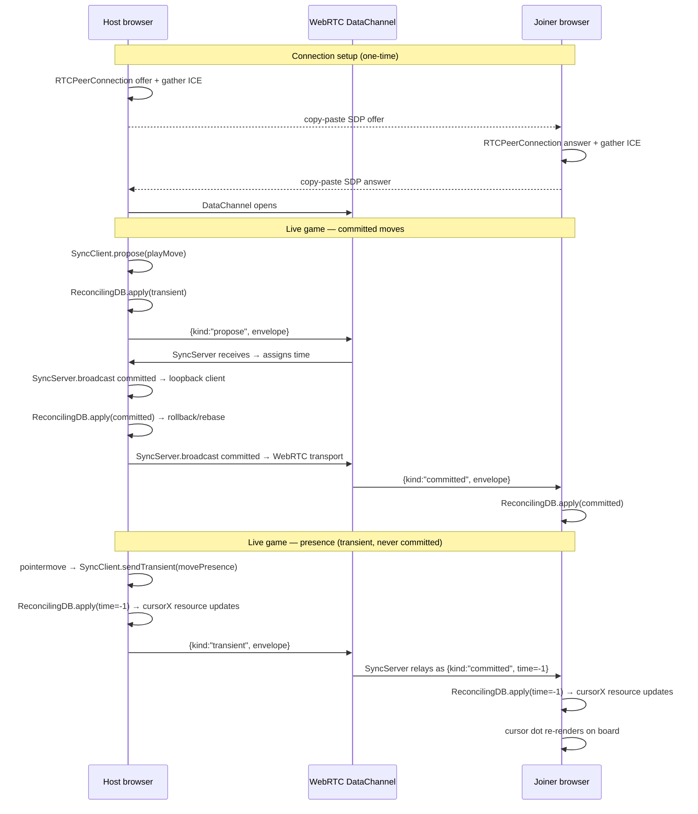
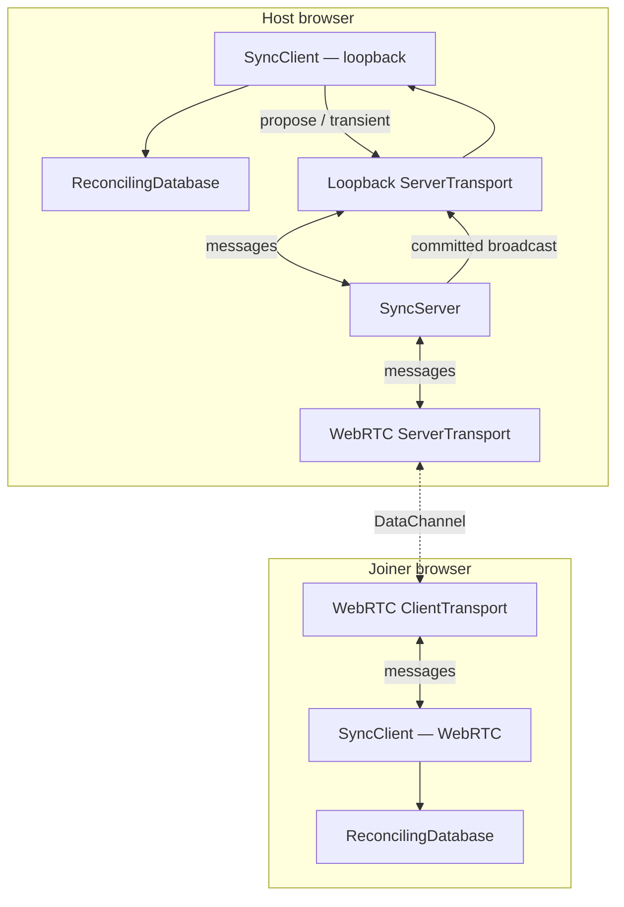
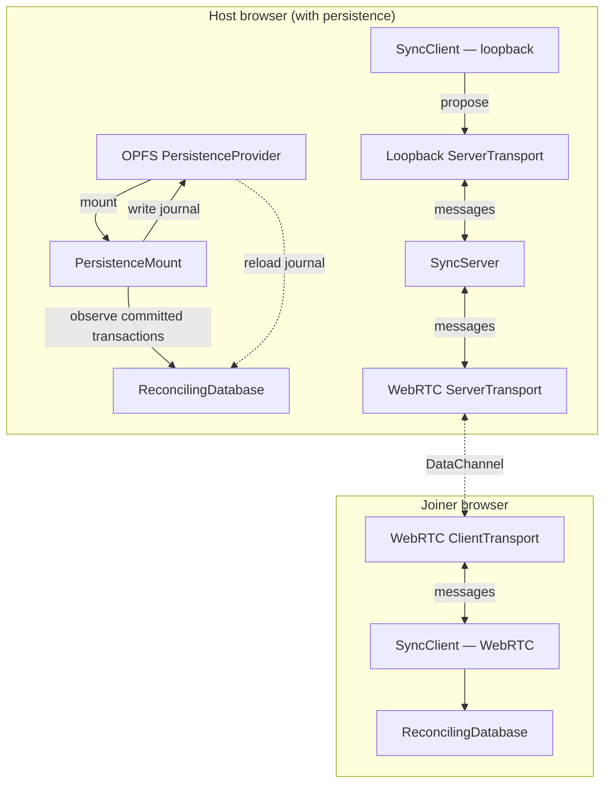
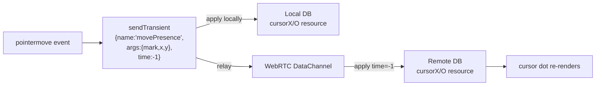

# P2P Tic-Tac-Toe — Architecture

A serverless two-player game that runs entirely in the browser.
No backend required: signaling is done by copy-pasting SDP blobs, and
real-time sync runs over a WebRTC DataChannel.

---

## Current architecture — in-memory sync, no persistence



### Component map



**Key points:**

- The host runs both `SyncServer` and its own `SyncClient` (via an
  in-process loopback transport). This lets the host receive its own
  committed envelopes and go through the same rollback/rebase path as the
  joiner — keeping both databases byte-identical.
- The joiner connects with a single `SyncClient` over the WebRTC transport.
- `sendTransient` envelopes (presence cursors) bypass the server's commit
  log. The server relays them to peers with `time: -1`, which the
  reconciling DB applies as a transient — overwriting the previous cursor
  position in the queue without committing.

---

## What adding persistence would look like

Persistence can be layered on the host's database **independently** of sync —
the two packages share only the committed `TransactionEnvelope` stream and
have no coupling to each other.



### What needs to be built

1. **Host-side persistence** — straightforward:
   ```ts
   import { mount, createOpfsProvider } from "@adobe/data-persistence/browser";
   const persistenceMount = await mount(createOpfsProvider(), hostDb);
   ```
   All committed transactions are journalled automatically. On page reload
   the host calls `mount` again and the journal is replayed into a fresh DB.

2. **Catch-up on joiner connect** — the one gap that would need to be added
   to `@adobe/data-sync`:

   Currently `SyncServer` is stateless — it holds the committed log already
   (see `committedLog` in `create-sync-server.ts`) and replays it to new
   clients on `connect()`. So a joiner who connects *after* moves have been
   made will already receive the full history. **This actually works today.**

   The gap is cross-session persistence: if the host reloads the page, the
   in-memory `committedLog` is lost. Replaying the journal into `hostDb`
   restores the database state, but a *new* `SyncServer` instance starts
   with an empty `committedLog`. The fix would be to pre-populate
   `committedLog` from the replayed journal before accepting new connections.

---

## Presence data flow



Presence uses **fixed envelope IDs** per player (`PRESENCE_ID.X = 0xF001`,
`PRESENCE_ID.O = 0xF002`). When `database.apply({ ..., time: -1 })` is
called with the same ID, the reconciling DB's rollback/reinsert logic
*replaces* the old entry rather than accumulating one per frame. The queue
therefore holds at most one cursor entry per player at any time.

Presence envelopes are never committed; they evaporate if the connection
drops. This is the correct semantic for ephemeral UI state.
