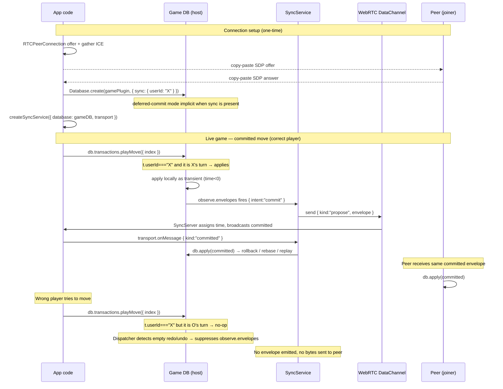
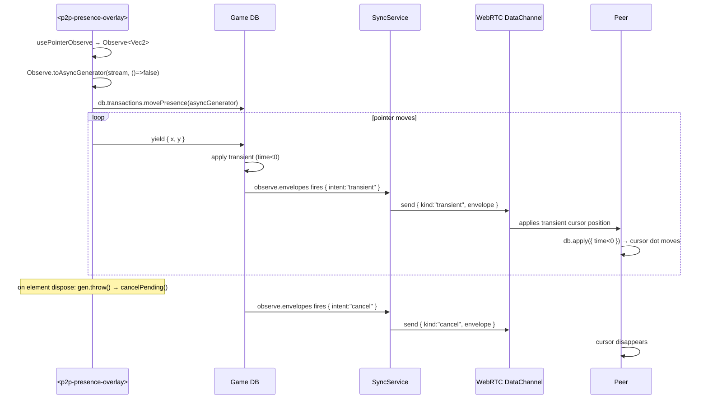
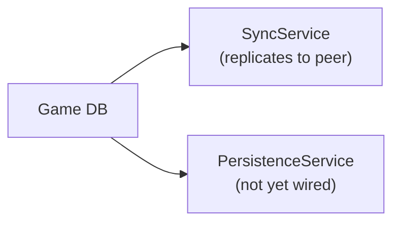

# P2P Tic-Tac-Toe — Architecture

A serverless two-player game that runs entirely in the browser.
No backend required: signaling is done by copy-pasting SDP blobs, and
real-time sync runs over a WebRTC DataChannel.

The application code never speaks to the sync layer directly. Every
mutation — whether a game move or a per-frame cursor position — flows
through `db.transactions.X(args)`. A `SyncService` attached to the synced
game database transparently forwards outbound envelopes and applies inbound
envelopes from peers.

---

## Two-database model

The application uses **two separate ECS databases**:

| Database | Plugin | Mode | Lifetime |
|---|---|---|---|
| Negotiation DB | `negotiationPlugin` | local-only | Entire page session |
| Game DB | `tictactoePlugin + presencePlugin` | synced | Created on connection |

The negotiation DB drives the signaling UI (phase, codes, banners). It is
purely local — never synced. Once both peers connect over WebRTC, the game DB
is created with `{ sync: { userId } }` so all game mutations replicate
transparently.

---

## Architecture

```mermaid
flowchart TB
    subgraph p2pttt [data-p2p-tictactoe sample]
        app["<p2p-app> (thin shell — combines plugins, sets roles)"]
        neg["<p2p-negotiation> (generic, negotiationDB local-only)"]
        overlay["<p2p-presence-overlay> (optional, reads cursorX/O)"]
    end
    subgraph litttt [data-lit-tictactoe library]
        ttt["<tictactoe-app> (typed on tictactoePlugin)"]
        plugin["tictactoePlugin (gated playMove by t.userId)"]
        agent["agentPlugin extends tictactoePlugin (AI-only)"]
    end
    subgraph datalib [core]
        ctx["t.userId in TransactionContext"]
        noop["no-op envelopes never replicated (dispatcher)"]
        sync["SyncService (transparent, reads observe.envelopes)"]
    end

    app --> neg
    neg -->|"on connect: mounts"| overlay
    overlay -->|"<slot>"| ttt
    ttt -->|"service injected"| neg
    plugin --> ttt
    agent -.standalone main.ts.-> ttt
    ctx --> plugin
    noop --> sync
```

---

## Sync sequence — committed game move



---

## Sync sequence — presence (transient, never committed)



---

## userId authorization

`Database.create(plugin, { sync: { userId } })` stamps every locally-generated
envelope with `userId` and passes it as `t.userId` inside every transaction
function:

```ts
// In tictactoePlugin:
playMove: (t, { index }) => {
    const mark = BoardState.currentPlayer(t.resources.board, t.resources.firstPlayer);
    // Gate: only the current player may move. In P2P mode userId = "X" or "O".
    // In standalone / AI mode userId is undefined → all moves allowed.
    if (t.userId !== undefined && t.userId !== mark) return;
    // ...
}
```

No-op transactions (where no store changes occur) are detected by the
dispatcher and their envelopes are suppressed — they never reach the
`SyncService` and are never forwarded to peers.

---

## Persistence (not currently implemented)

The synced game DB could be given persistence by wrapping it in a
`PersistenceService` backed by `IndexedDB` (browser) or the filesystem
(Node). This is completely orthogonal to sync: persistence saves the committed
state to disk; sync replicates it to peers. Either, neither, or both can be
active simultaneously.


